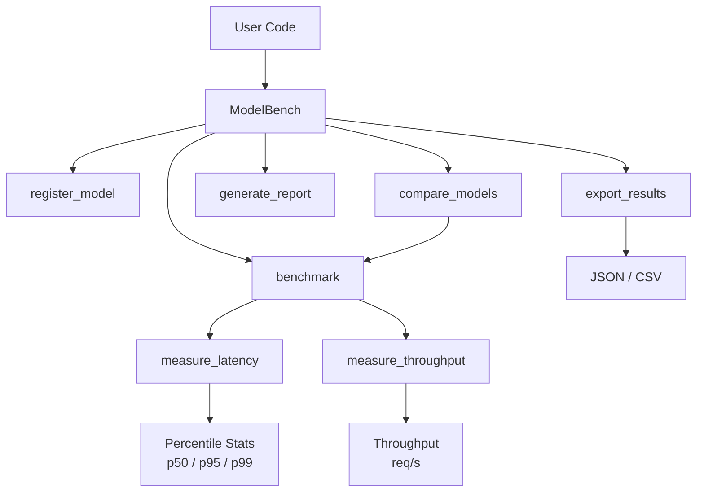

# ModelBench

[](https://github.com/officethree/ModelBench/actions/workflows/ci.yml)
[](https://www.python.org/downloads/)
[](LICENSE)

**Model serving benchmark toolkit** — a Python library for benchmarking and comparing model inference performance (latency, throughput, memory) across different serving configurations.

---

## Architecture



## Quickstart

### Installation

```bash
pip install -e .
```

### Basic Usage

```python
from modelbench import ModelBench, BenchmarkConfig

# Define inference functions
def model_a(x):
    return x * 2

def model_b(x):
    import time; time.sleep(0.001)
    return x * 3

# Set up the benchmark
config = BenchmarkConfig(iterations=50, throughput_duration=2.0)
bench = ModelBench(config=config)

# Register models
bench.register_model("model_a", model_a)
bench.register_model("model_b", model_b)

# Benchmark a single model
result = bench.benchmark("model_a", inputs=list(range(100)))
print(result.summary())

# Compare models side by side
results = bench.compare_models(["model_a", "model_b"], inputs=list(range(100)))
print(bench.generate_report(results))

# Export results
bench.export_results(results, format="json", path="results.json")
```

### Sample Output

```
ModelBench Comparison Report
============================

+----------+---------+---------+---------+---------+-------------+
| Model    | p50     | p95     | p99     | Mean    | Throughput  |
+----------+---------+---------+---------+---------+-------------+
| model_a  | 0.01 ms | 0.02 ms | 0.03 ms | 0.01 ms | 98,500 req/s|
| model_b  | 1.05 ms | 1.12 ms | 1.18 ms | 1.06 ms | 940.12 req/s|
+----------+---------+---------+---------+---------+-------------+

Benchmarked 2 model(s).
```

## Configuration

ModelBench can be configured via constructor arguments or environment variables:

| Parameter              | Env Variable                   | Default | Description                          |
|------------------------|--------------------------------|---------|--------------------------------------|
| `iterations`           | `MODELBENCH_ITERATIONS`        | 100     | Number of latency measurement iterations |
| `throughput_duration`  | `MODELBENCH_THROUGHPUT_DURATION`| 10.0    | Seconds to run throughput test       |
| `warmup_iterations`    | `MODELBENCH_WARMUP_ITERATIONS` | 5       | Warmup calls before measurement      |
| `output_dir`           | `MODELBENCH_OUTPUT_DIR`        | `benchmark_results` | Export output directory    |

## Development

```bash
# Install dev dependencies
make dev

# Run tests
make test

# Lint
make lint
```

## Project Structure

```
src/modelbench/
  __init__.py     # Public API
  core.py         # ModelBench class, BenchmarkResult
  config.py       # BenchmarkConfig (pydantic)
  utils.py        # Timing, percentile, formatting utilities
tests/
  test_core.py    # Unit tests
docs/
  ARCHITECTURE.md # Detailed architecture documentation
```

---

Inspired by model serving and MLOps trends.

---

Built by [Officethree Technologies](https://officethree.com) | Made with love and AI
