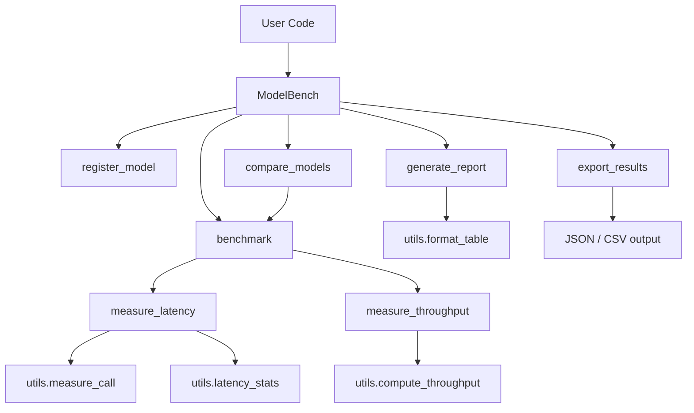

# Architecture

## Overview

ModelBench is a lightweight Python toolkit for benchmarking model inference performance across different serving configurations. It measures latency (with percentile breakdowns), throughput, and produces structured comparison reports.

## Component Diagram

## Module Responsibilities

### `core.py`

The central module containing:

- **`BenchmarkResult`** — A Pydantic model capturing all metrics from a single benchmark run (p50/p95/p99 latencies, throughput, stats).
- **`ModelBench`** — The main class that holds a registry of model inference functions and orchestrates benchmarking:
  - `register_model()` — Adds an inference callable to the registry.
  - `benchmark()` — Runs latency and throughput measurements for a single model.
  - `measure_latency()` — Times individual calls over N iterations.
  - `measure_throughput()` — Counts completions within a time window.
  - `compare_models()` — Benchmarks multiple models and ranks by p50 latency.
  - `generate_report()` — Builds an ASCII table comparison.
  - `export_results()` — Serialises results to JSON or CSV.

### `config.py`

- **`BenchmarkConfig`** — Pydantic settings model with defaults that can be overridden via environment variables or constructor arguments (iterations, throughput duration, warmup, output directory).

### `utils.py`

Pure-function utilities:

- `timer()` — Context manager for measuring elapsed time.
- `measure_call()` — Times a single function call.
- `percentile()` — Computes arbitrary percentiles via linear interpolation.
- `latency_stats()` — Returns a dict of mean, median, stdev, min, max, p50, p95, p99.
- `compute_throughput()` — Calculates requests-per-second.
- Formatting helpers for durations, throughput, and ASCII tables.

## Data Flow

1. User registers one or more inference functions via `register_model()`.
2. `benchmark()` warms up, then runs `measure_latency()` followed by `measure_throughput()`.
3. Raw latency list is fed into `latency_stats()` to compute percentiles.
4. Results are packed into a `BenchmarkResult` Pydantic model.
5. `compare_models()` collects results for multiple models and sorts by p50.
6. `generate_report()` or `export_results()` serialises for human or machine consumption.

## Design Decisions

- **No ML framework dependency** — Inference functions are plain callables, so ModelBench works with PyTorch, TensorFlow, ONNX Runtime, HTTP endpoints, or anything else.
- **Pydantic for validation** — Configs and results are strongly typed and serialisable.
- **Warmup phase** — Prevents cold-start artefacts from skewing results.
- **Percentile-first** — p50/p95/p99 are first-class metrics because mean alone hides tail latency.
